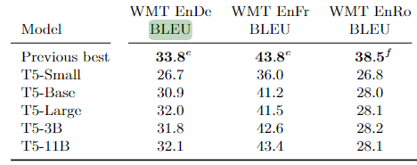

## nllb-200-distilled-600M ##
https://huggingface.co/facebook/nllb-200-distilled-600M \
多语言翻译模型，需要给出源语言和目标语言， 少于 512 tokens \
[指标](metrics.csv)

flores-200 数据集评估
https://paperswithcode.com/dataset/flores-200
## T5 ## 
https://huggingface.co/google-t5/t5-base \
统一的text2text的语言模型，mt是其中一个任务 \
翻译任务加上前缀: "translate xx to xx: "  \
 \
We did not achieve state-of-the-art performance on any of the WMT translation tasks. \
似乎没有达到最先进的性能